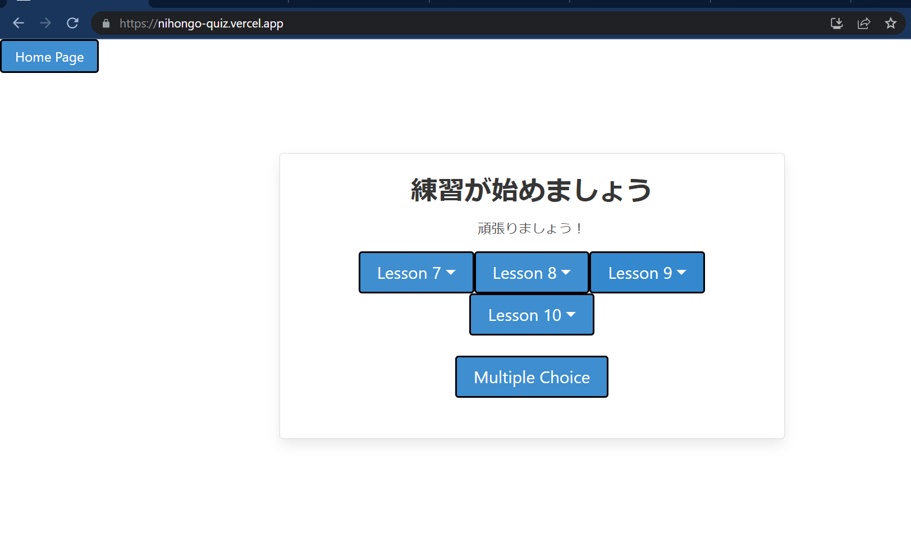
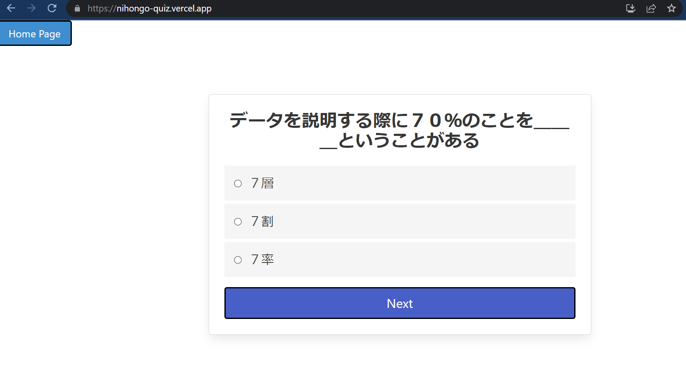

# Nihongo Quiz

  

## Tech Stack
- React
- Bootstrap
- HTML
- Vercel to host

## About
Nihongo quiz is a web application created with the react library. The website is designed with boostrap.

## Features
Users can either choose to do writing or multiple choice practice.
After completing a quiz they are given a score and the answers

## More
- [Github](https://adocs.vercel.app)
- [Demo](https://nihongo-quiz.vercel.app/)