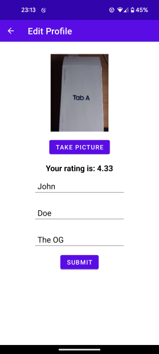
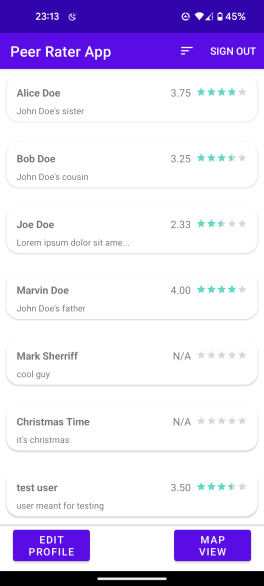

# Peer Rater (School Project)

    

        
    

    

        
    

## Tech Stack
- Firebase
- Kotlin
- Google Maps API

## About
Peer Rater is a revolutionary social app where users can view other users, give ratings, and view other user locations on the map. 

User information is saved to Firebase Cloud Firestore and Firebase Storage and their accounts are secured with Firebase authentication. One additional feature the app provides is that it gives users the ability to communicate with each other through email. We were inspired by “Meow Meow Beenz” a fictional mobile application from the TV show ["Community"](https://www.youtube.com/watch?v=CI4kiPaKfAE)