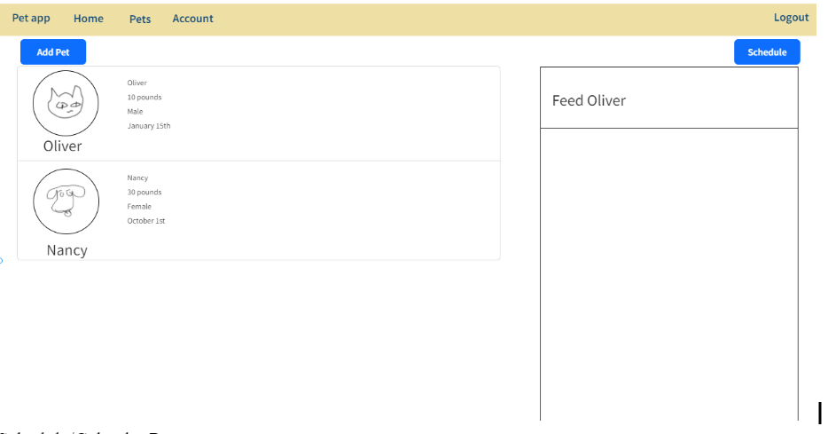

# PetPals (School Project)

  

## Tech Stack
- PHP
- MYSQL
- JQUERY
- CSS
- HTML

## About
A web application for storing and tracking information on a person’s various pets. A user logs in and can create new pet entries. These entries include things like an image, pet type, name, birthday, food, immunizations, etc. A calendar is available for scheduling walks, vacations (and having people watch the pets), and visits to the vet.

## More
- [Github](https://github.com/BiaDd/cs4640project)