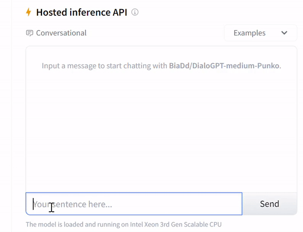

# Punko

  

## Tech Stack
- Python
- Huggingface

## About
Punko is a project meant for learning AI. I have integrated a few custom AI models to develop an AI Chatbot and an AI image generation feature for this bot

The AI Chatbot portion of this bot uses the [Microsoft DialoGPT conversational model](https://huggingface.co/microsoft/DialoGPT-medium) trained with message from people in family groupchat. I followed [Lynn Zheng's tutorial](https://www.freecodecamp.org/news/discord-ai-chatbot/) to create this portion of the bot.

Here is a demo of the Discord bot AI chat function.

## More
- [Github](https://github.com/BiaDd/Punko)
- [Chatbot Demo](https://huggingface.co/BiaDd/DialoGPT-medium-Punko)
- [Image Generation Demo](https://huggingface.co/BiaDd/Dreambooth-Punko)